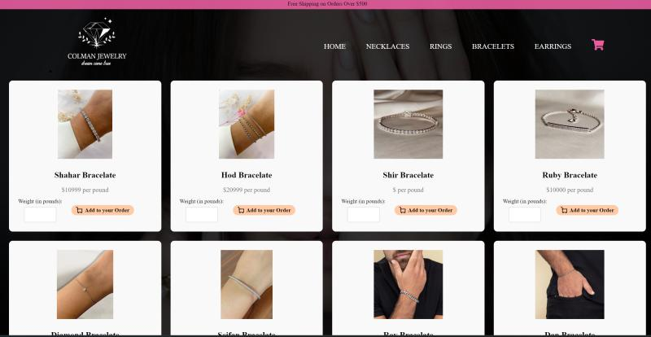

# Jewelry Store Website 💎

Achieved a perfect score of 100 on the final project for the Web-Based Applications Development course. Developed an online jewelry store using HTML, CSS, JavaScript, and NodeJS. The project included features such as user registration and authentication with cookies, and comprehensive product management in the database (adding, editing, removing) on both client and server sides.
(adding\editing\removing), both client and server sides.

## ✨ Features
- Responsive layout for desktop and mobile
- Intuitive navigation
- Product browsing interface
- Clean and elegant UI

## 🛠️ Technologies Used
- HTML
- CSS
- JavaScript
- MongoDB
- Node js
- Express.js

## 🚀 How to Run
Clone this repository and open `index.html`:

```bash
git clone https://github.com/shirzohar/online-jewelry-store.git
cd online-jewelry-store
open index.html

## 📷 Screenshots




